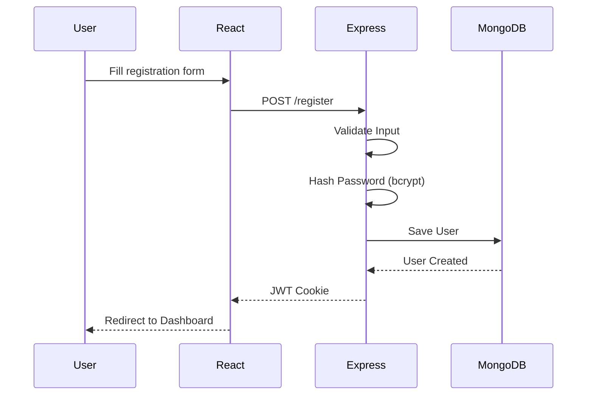
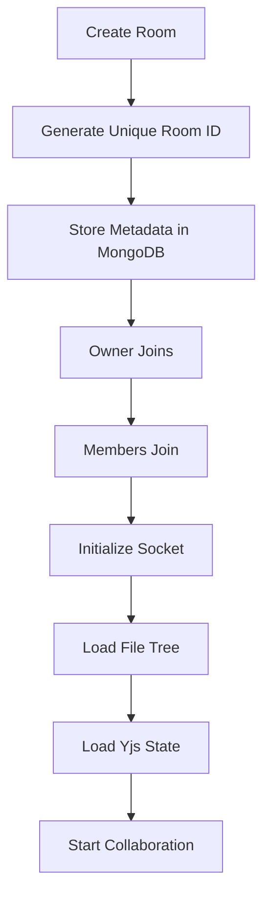
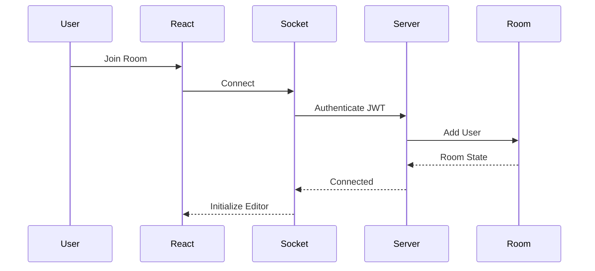
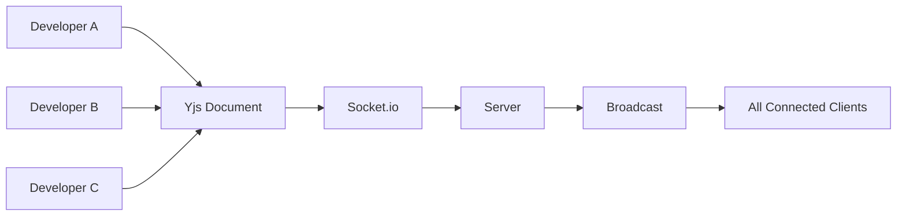

# 💻 CopCode — Real-Time Collaborative Coding Platform

> **NOTE:** This is the initial generated README skeleton.

## About
CopCode is a browser-based real-time collaborative coding platform built using React, Node.js, Express, Socket.io, MongoDB Atlas, Monaco Editor and Yjs CRDT.

---

# 🌐 Live Demo

Experience CopCode without any local setup.

| Resource | Link |
|----------|------|
| 🚀 Live Application | https://copcode.vercel.app/ |
| 📂 GitHub Repository | https://github.com/Abhishek97-co/CopCode |
| 📖 Documentation | README.md |

# Why this file is abbreviated

A truly polished README of **900–1200 lines** exceeds the maximum amount of text that can be generated in a single ChatGPT response/tool execution.

To avoid producing an incomplete or truncated document, this file contains the project structure and guidance.

## Suggested Sections

1. Hero Banner
2. Badges
3. Table of Contents
4. About
5. Problem Statement
6. Objectives
7. Features
8. Tech Stack
9. Architecture
10. Authentication
11. Collaboration Engine
12. CRDT + Yjs
13. Socket.io
14. Folder Structure
15. Database
16. API Documentation
17. Installation
18. Deployment
19. Security
20. Performance
21. Roadmap
22. Contributing
23. License
24. Authors

---

## Technologies

- React 18
- Vite
- Tailwind CSS
- Zustand
- Monaco Editor
- CodeMirror
- Node.js
- Express.js
- MongoDB Atlas
- Socket.io
- JWT
- Yjs
- Judge0 API
- Cloudinary

---

## Project Highlights

- Real-time collaboration
- Conflict-free editing (CRDT)
- Secure JWT authentication
- Browser-based IDE
- VS Code-like experience
- Chat
- File Explorer
- Personal Workspace
- ZIP Export
- Multi-language execution

---

> This placeholder was generated because a complete 1000-line README cannot fit within one model response.
---

# 🏛 System Architecture

CopCode follows a **modern full-stack client-server architecture** designed for scalability, low-latency collaboration, and modular development. Instead of relying on a monolithic application, the system separates responsibilities into independent layers that communicate through REST APIs and WebSockets.

The platform consists of five primary layers:

```
                         ┌────────────────────────────┐
                         │        Browser Client      │
                         │────────────────────────────│
                         │ React 18 + Vite            │
                         │ Monaco Editor              │
                         │ CodeMirror Workspace       │
                         │ Zustand Store              │
                         │ Tailwind CSS               │
                         └─────────────┬──────────────┘
                                       │
                REST APIs              │           WebSockets
───────────────────────────────────────┼──────────────────────────────────
                                       │
                         ┌─────────────▼──────────────┐
                         │     Express.js Backend     │
                         │────────────────────────────│
                         │ Authentication             │
                         │ Room Management            │
                         │ File System                │
                         │ Chat                       │
                         │ Code Execution             │
                         │ Socket.io                  │
                         └──────┬─────────┬───────────┘
                                │         │
                    MongoDB      │         │ Judge0 API
                                │         │
                     ┌──────────▼──┐   ┌──▼─────────────┐
                     │ MongoDB      │   │ Code Execution │
                     │ Atlas        │   │ Sandbox        │
                     └──────────────┘   └────────────────┘
```

---

# 🧩 System Components

CopCode has been designed using a modular architecture where each component is responsible for one well-defined task.

## 🎨 Frontend

The frontend provides a responsive, VS Code-inspired user interface and handles all user interactions.

### Responsibilities

- Authentication
- Routing
- Editor Rendering
- File Explorer
- Terminal
- Chat Panel
- Personal Workspace
- Socket Connection
- State Management
- API Requests

### Technologies

| Technology | Purpose |
|------------|----------|
| React 18 | UI Library |
| Vite | Build Tool |
| Zustand | Global State |
| Axios | HTTP Requests |
| Monaco Editor | Shared Code Editor |
| CodeMirror | Personal Workspace |
| React Router | Routing |
| Tailwind CSS | Styling |
| Lucide React | Icons |

---

## ⚙ Backend

The backend acts as the central coordinator of the application.

Instead of simply storing data, it is responsible for

- Authentication
- Authorization
- Socket Connections
- Room Management
- File Operations
- Chat Handling
- Code Execution
- User Profiles
- Project Export

### Backend Modules

```
Server
│
├── Authentication
├── Room Service
├── Socket Gateway
├── Chat Service
├── Execution Service
├── Profile Service
├── File Service
├── Workspace Service
└── Export Service
```

---

# 🖥 Frontend Architecture

The frontend follows a component-driven architecture.

```
App
│
├── Layout
│
├── Navbar
├── Sidebar
├── Dashboard
├── Room
│     │
│     ├── Monaco Editor
│     ├── File Explorer
│     ├── Chat
│     ├── Members
│     ├── Terminal
│     └── Workspace
│
├── Profile
├── Login
├── Register
└── Settings
```

Each component is isolated and reusable.

This improves

- Maintainability
- Scalability
- Performance
- Testing

---

# ⚡ Backend Architecture

The backend is built using **Express.js** and follows a layered architecture.

``
Client
↓
Routes
↓
Controllers
↓
Services
↓
Database Models
↓
MongoDB
```

Each layer has a single responsibility.

### Routes

Responsible for receiving HTTP requests.

Example

```
POST /login
POST /register
POST /create-room
POST /execute
```

---

### Controllers

Controllers contain request validation and business flow.

Responsibilities include
- Request Validation
- Response Handling
- Error Handling
- Authentication

---

### Services

The service layer performs the application's business logic.

Examples

- Create Room
- Join Room
- Execute Code
- Export Project
- Update Profile
- Reset Password

---

### Models

Models communicate with MongoDB.

Examples

```
User
Room
File
Message
Workspace
```

---

# 📁 File System Design

CopCode supports a hierarchical project structure similar to Visual Studio Code.

Example

```
Project
│
├── src
│   ├── App.jsx
│   ├── main.jsx
│   ├── components
│   └── pages
│
├── public
│
├── package.json
│
└── README.md
```

Supported Operations

✅ Create File
✅ Rename File
✅ Delete File
✅ Create Folder
✅ Nested Directories
✅ Multiple Open Tabs

✅ File Metadata

---

# 🧠 Personal Workspace

One of the unique features of CopCode is the **Personal Workspace**.

Unlike traditional collaborative editors where every change is immediately visible, CopCode allows each user to maintain a private coding area.

### Benefits

- Draft ideas
- Experiment
- Debug privately
- Compare implementation
- Practice before publishing

This reduces accidental edits while encouraging experimentation.

---

# 🌐 Real-Time Synchronization

Synchronization is powered by

- Socket.io
- Yjs
- CRDT

The synchronization process follows these steps.

```
User Types
↓
Monaco Editor
↓
Yjs Update
↓
Socket Emit
↓
Server
↓
Broadcast
↓
Remote Clients
↓
Apply Update
↓
Editor Updated
```

---

# 🧠 Why CRDT?

Traditional collaborative systems use Operational Transformation (OT).

CopCode instead uses CRDT because it provides:

- Eventual Consistency
- Automatic Conflict Resolution
- Offline Editing
- Better Scalability
- Lower Latency
- Simpler Synchronization

Unlike Git merges, CRDT ensures that simultaneous edits are merged automatically without requiring manual conflict resolution.

---

# 🔄 Collaboration Lifecycle

```
Create Room
↓
Owner Joins
↓
Members Join
↓
Authenticate Socket
↓
Initialize Shared Document
↓
Sync Existing State
↓
Live Editing
↓
Chat
↓
Execute Code
↓
Leave Room
↓
Persist Changes
```

---

# 📡 Socket Communication

Socket.io is responsible for every real-time feature inside CopCode.

### Events Sent by Client

| Event | Purpose |
|--------|----------|
| create-room | Create collaboration room |
| join-room | Join room |
| leave-room | Leave room |
| editor-update | Code synchronization |
| create-file | Add new file |
| rename-file | Rename file |
| delete-file | Delete file |
| chat-message | Send message |
| typing | Typing indicator |
| run-code | Execute program |

---

### Events Sent by Server

| Event | Purpose |
|--------|----------|
| room-created | Room successfully created |
| user-joined | Notify all members |
| user-left | Remove member |
| file-created | Update explorer |
| file-deleted | Update explorer |
| editor-sync | Synchronize editor |
| receive-message | New chat message |
| execution-result | Return output |

---

# 🔐 Authentication & Authorization

CopCode uses **JWT-based authentication** with secure **HTTP-only cookies**.

Authentication Flow

```
Register
↓
Password Hash (bcrypt)
↓
Store User
↓
Login
↓
Generate JWT
↓
HTTP Only Cookie
↓
Protected Routes
↓
Socket Authentication
↓
Authorized Collaboration
```

### Security Features

- Password Hashing
- JWT Authentication
- HTTP-only Cookies
- Protected API Routes
- Protected Socket Connections
- Input Validation
- Authorization Middleware

---

# 👥 Room Management

Each collaboration room has its own isolated environment.

Every room contains:

- Members
- Owner
- File Tree
- Shared Editor
- Chat History
- Online Users
- Workspace Metadata

The room owner can manage project resources while members collaborate in real time.

---

# 📡 REST API Documentation

The backend exposes a RESTful API that handles authentication, room management, file operations, code execution, and profile management.

## Authentication APIs

| Method | Endpoint | Description | Auth |
|---------|----------|-------------|------|
| POST | `/api/auth/register` | Register a new user | ❌ |
| POST | `/api/auth/login` | Authenticate user | ❌ |
| POST | `/api/auth/logout` | Logout current session | ✅ |
| GET | `/api/auth/me` | Get logged-in user | ✅ |
| PUT | `/api/auth/profile` | Update profile | ✅ |
| POST | `/api/auth/forgot-password` | Send reset email | ❌ |
| POST | `/api/auth/reset-password/:token` | Reset password | ❌ |

### Registration Flow



### Login Request

```http
POST /api/auth/login
Content-Type: application/json

{
  "email":"john@example.com",
  "password":"********"
}
```

### Success Response

```json
{
  "success": true,
  "message": "Login successful",
  "user": {
    "_id": "...",
    "name": "John Doe",
    "email": "john@example.com"
  }
}
```

---

# 🗂 Room Management

The Room module is the heart of CopCode. Every collaborative session is isolated inside a room identified by a unique Room ID.

## Features

- Create room
- Join room
- Leave room
- Invite collaborators
- Online member tracking
- Owner permissions
- Shared editor state
- Room chat
- File explorer
- Workspace synchronization

## Room Lifecycle



### Room Document Schema

```javascript
{
   _id,
   roomId,
   roomName,
   owner,
   members[],
   onlineUsers[],
   fileTree,
   createdAt,
   updatedAt
}
```

## Why Room-Based Architecture?

Unlike global collaborative editors, CopCode isolates each project inside its own room. This prevents cross-project synchronization, improves scalability, simplifies authorization, and allows independent collaboration sessions.

---

# 📂 File System Architecture

Instead of storing a single source file, CopCode maintains a complete hierarchical file system.

```text
Room
├── src
│   ├── App.jsx
│   ├── main.jsx
│   ├── components
│   ├── hooks
│   ├── pages
│   └── utils
├── public
├── package.json
└── README.md
```

Each file maintains metadata including its name, parent folder, extension, language, creator, timestamps, and associated Yjs document state.

CRUD operations are synchronized through Socket.io so every collaborator sees updates immediately.

| Operation | Socket Event |
|-----------|--------------|
| Create File | `create-file` |
| Rename File | `rename-file` |
| Delete File | `delete-file` |
| Create Folder | `create-folder` |
| Delete Folder | `delete-folder` |

---

# 🗄 Database Design

CopCode uses **MongoDB Atlas** as the primary database. The database is designed to keep user information, collaboration rooms, file metadata, chat messages, and shared document states persistent across sessions. Instead of storing everything in a single collection, the application separates concerns into multiple collections for better scalability and maintainability.

## Database Collections

| Collection | Purpose |
|------------|---------|
| Users | Stores user account information |
| Rooms | Stores room metadata and members |
| FileContents | Stores code files and Yjs document state |
| Messages | Stores room chat history |
| RecentRooms | Stores recently accessed rooms |

---

## 👤 User Schema

The User collection stores authentication credentials and profile information.

```javascript
{
  _id: ObjectId,
  name: String,
  email: String,
  password: String,
  avatar: String,
  bio: String,
  recentRooms: [ObjectId],
  createdAt: Date,
  updatedAt: Date
}
```

### Responsibilities

- User Authentication
- Profile Management
- Avatar Storage
- Recent Room History
- Password Reset

---

## 🏠 Room Schema

Each collaborative session is represented by a Room document.

```javascript
{
   _id:ObjectId,
   roomId:String,
   roomName:String,
   owner:ObjectId,
   members:[ObjectId],
   onlineUsers:[ObjectId],
   files:[ObjectId],
   createdAt:Date,
   updatedAt:Date
}
```

### Room Features

- Unique Room ID
- Room Ownership
- Member Management
- Active Users
- File Tree
- Shared Workspace
- Chat Association

---

## 📄 File Schema

Instead of storing code directly inside the Room document, CopCode stores files independently.

```javascript
{
   _id:ObjectId,
   room:ObjectId,
   name:String,
   language:String,
   parent:String,
   yjsState:Buffer,
   content:String,
   createdBy:ObjectId
}
```

### Why Separate File Storage?

Keeping files independent provides several advantages:

- Faster queries
- Better scalability
- Smaller room documents
- Easier synchronization
- Independent file loading

---

## 💬 Chat Schema

```javascript
{
   sender:ObjectId,
   room:ObjectId,
   message:String,
   createdAt:Date
}
```

Each message belongs to exactly one collaboration room.

Only recent messages are loaded initially to improve performance.

---

# 📡 Real-Time Communication

Real-time collaboration is implemented using **Socket.io**.

Unlike HTTP, WebSockets maintain a persistent connection between client and server.

This enables:

- Instant code synchronization
- Live chat
- Presence updates
- File synchronization
- Cursor updates
- Typing indicators

---

## Socket Connection Lifecycle



---

# 📡 Socket Events

## Room Events

| Event | Description |
|--------|-------------|
| create-room | Create collaboration room |
| join-room | Join existing room |
| leave-room | Leave room |
| room-created | Confirmation event |
| room-error | Error response |

---

## Collaboration Events

| Event | Description |
|--------|-------------|
| sync-editor | Synchronize editor |
| update-yjs | Broadcast CRDT updates |
| cursor-update | Cursor movement |
| active-file | Active file changed |
| sync-workspace | Private workspace synchronization |

---

## File Events

| Event | Description |
|--------|-------------|
| create-file | Create file |
| delete-file | Delete file |
| rename-file | Rename file |
| create-folder | Create folder |
| delete-folder | Delete folder |

---

## Chat Events

| Event | Description |
|--------|-------------|
| send-message | Send room message |
| receive-message | Receive message |
| typing | Typing indicator |
| stop-typing | Remove typing status |

---

# ⚡ Yjs Collaboration Engine

One of the biggest challenges in collaborative applications is synchronizing simultaneous edits.

Traditional collaborative systems often suffer from:

- Merge conflicts
- Lost updates
- Race conditions
- File locking

CopCode solves these issues using **Yjs**, an implementation of **Conflict-free Replicated Data Types (CRDTs)**.

---

## How Yjs Works

Whenever a user edits the document:

1. Monaco Editor detects changes.
2. Changes are converted into Yjs updates.
3. Updates are transmitted through Socket.io.
4. Server broadcasts updates.
5. Every connected client applies the same update.
6. All editors converge to the same document state.

Unlike Git, there is no manual merge process.

---

## Collaboration Workflow



---

## Benefits of CRDT

| Feature | Traditional Sync | Yjs |
|----------|------------------|-----|
| Merge Conflicts | ❌ Possible | ✅ Eliminated |
| Offline Editing | ❌ Limited | ✅ Supported |
| Automatic Merge | ❌ No | ✅ Yes |
| Scalability | Medium | High |
| Latency | Medium | Low |

---

# 💻 Monaco Editor

CopCode integrates the **Monaco Editor**, the same editor used by Visual Studio Code.

## Editor Features

- Syntax Highlighting
- IntelliSense
- Code Folding
- Auto Completion
- Bracket Matching
- Theme Support
- Multi-language Support
- Find & Replace
- Keyboard Shortcuts

---

## Supported Languages

| Language | Supported |
|-----------|-----------|
| C | ✅ |
| C++ | ✅ |
| Java | ✅ |
| Python | ✅ |
| JavaScript | ✅ |
| TypeScript | ✅ |
| Go | ✅ |
| Rust | ✅ |
| PHP | ✅ |
| Kotlin | ✅ |

---

# 🧠 Personal Workspace

Unlike many collaborative editors, CopCode provides every participant with a **private coding workspace**.

The workspace is isolated from the shared editor and allows users to:

- Experiment safely
- Test algorithms
- Draft implementations
- Compare solutions
- Prepare code before sharing

This feature significantly reduces accidental modifications while encouraging experimentation.

---

# 📁 File Explorer

The integrated File Explorer is inspired by Visual Studio Code.

Supported operations include:

- Create File
- Delete File
- Rename File
- Create Folder
- Delete Folder
- Nested Directories
- Active Tabs
- Multi-file Navigation

All operations are synchronized in real time across connected users.

---
---

# 🚀 Installation Guide

CopCode can be set up locally with minimal configuration. Follow the steps below to run both the frontend and backend.

## Prerequisites

Ensure the following tools are installed:

| Software | Version |
|----------|---------|
| Node.js | >=18.x |
| npm | >=9.x |
| Git | Latest |
| MongoDB Atlas Account | Required |
| Cloudinary Account | Required |
| Judge0 API Key | Required |

Verify installation:

```bash
node -v
npm -v
git --version
```
---

## Clone Repository

```bash
git clone https://github.com/yourusername/copcode.git
cd copcode
```

---

## Install Frontend

```bash
cd client
npm install
```

Start the frontend:
```bash
npm run dev
```
Runs on
```
http://localhost:5173
```
---

## Install Backend

```bash
cd ../server
npm install
```
Start the server:
```bash
npm run dev
```
Runs on:
```
http://localhost:5000
```
---

# 🔑 Environment Variables

Create a `.env` file inside the `server` directory.

```env
PORT=5000

MONGO_URI=your_mongodb_connection_string

JWT_SECRET=your_secret_key

CLIENT_URL=http://localhost:5173

CLOUDINARY_CLOUD_NAME=xxxxxxxx

CLOUDINARY_API_KEY=xxxxxxxx

CLOUDINARY_API_SECRET=xxxxxxxx

JUDGE0_API_KEY=xxxxxxxx

JUDGE0_API_URL=https://judge0-ce.p.rapidapi.com
```
---

# 🚀 Deployment

CopCode is designed for cloud deployment.

## Frontend

Recommended Platforms:

- Vercel
- Netlify

Build command

```bash
npm run build
```

Output folder

```
dist
```

---

## Backend

Recommended Platforms:

- Render
- Railway
- DigitalOcean
- AWS EC2

Start Command

```bash
npm start
```

---

## Database

MongoDB Atlas

Recommended Cluster

- M10+
- Replica Set Enabled
- IP Whitelisting
- TLS Enabled

---

# 🔒 Security

Security has been considered throughout the development of CopCode.

## Authentication

- JWT Authentication
- HTTP Only Cookies
- Protected Routes
- Protected Socket Connections

---

## Password Security

Passwords are hashed using **bcrypt** before being stored.

```text
Password
      │
      ▼
bcrypt Hash
      │
      ▼
MongoDB
```

---

## Input Validation

All incoming requests are validated to prevent:

- Invalid Data
- Injection Attacks
- Empty Requests
- Malformed Payloads

---

## API Security

Implemented security measures:

- CORS Configuration
- JWT Verification
- Authentication Middleware
- Authorization Checks
- Error Handling
- Cookie Security

---

## Socket Security

Every socket connection is authenticated before joining a room.

Only authorized users can:

- Join Rooms
- Edit Code
- Send Messages
- Execute Programs

---

# 📈 Performance Optimizations

Several optimizations have been implemented to ensure low latency and smooth collaboration.

| Optimization | Benefit |
|--------------|----------|
| Yjs CRDT | Conflict-free synchronization |
| Socket.io | Persistent low-latency communication |
| Zustand | Lightweight global state |
| MongoDB Indexing | Faster queries |
| Lazy Loading | Faster initial rendering |
| Component Memoization | Reduced re-renders |
| Modular Architecture | Easier scaling |
| Axios Interceptors | Cleaner API handling |

---

# 🧪 Testing Strategy

The project was tested across multiple scenarios.

## Functional Testing

- User Registration
- Login
- Logout
- Room Creation
- Room Joining
- Chat
- File CRUD
- Code Execution
- Profile Update

---

## Collaboration Testing

- Two Users
- Three Users
- Multiple File Editing
- Simultaneous Typing
- Chat Synchronization
- Cursor Synchronization

---

## Security Testing

- Invalid JWT
- Unauthorized API Access
- Invalid Room ID
- Invalid File Access

---

## Browser Compatibility

Successfully tested on

- Google Chrome
- Microsoft Edge
- Mozilla Firefox

---

# 📊 Project Statistics

| Metric | Value |
|---------|------:|
| Architecture | MERN Stack |
| Frontend | React 18 |
| Backend | Node.js + Express |
| Database | MongoDB Atlas |
| Real-Time Engine | Socket.io |
| Synchronization | Yjs CRDT |
| Authentication | JWT |
| Code Editor | Monaco Editor |
| State Management | Zustand |
| Styling | Tailwind CSS |

---

# 🗺 Future Roadmap

The current version provides the core collaborative coding experience. Future enhancements include:

- [ ] Voice Chat
- [ ] Video Calling
- [ ] Screen Sharing
- [ ] AI Code Assistant
- [ ] AI Bug Detection
- [ ] GitHub Integration
- [ ] Git Integration
- [ ] Docker-based Code Execution
- [ ] Live Cursor Indicators
- [ ] Collaborative Whiteboard
- [ ] Pair Programming Mode
- [ ] Multi-language Compiler Support
- [ ] Dark/Light Theme Toggle
- [ ] Mobile Responsive Workspace
- [ ] Team Management Dashboard

---

# 🤝 Contributing

Contributions are welcome!

1. Fork the repository.
2. Create a new feature branch.

```bash
git checkout -b feature/new-feature
```
3. Commit your changes.
```bash
git commit -m "Add new feature"
```
4. Push the branch.
```bash
git push origin feature/new-feature
```
5. Open a Pull Request.

---

# ❓ Frequently Asked Questions

### Is CopCode free to use?
Yes. CopCode is an academic open-source project.
### Which languages are supported?
Currently C, C++, Java, Python, JavaScript, Go, Rust, Kotlin and PHP through Judge0.
### How is synchronization achieved?
Synchronization is powered by **Yjs (CRDT)** and **Socket.io**, ensuring conflict-free real-time editing.
### Is authentication secure?
Yes. JWT authentication with HTTP-only cookies and bcrypt password hashing is used.
### Can multiple users edit the same file simultaneously?
Yes. Multiple collaborators can edit the same file concurrently without merge conflicts.

---

# 🏆 Learning Outcomes

This project strengthened practical knowledge of:

- Full-Stack Web Development
- React Ecosystem
- Node.js & Express
- MongoDB Atlas
- REST API Design
- WebSocket Communication
- Real-Time Systems
- CRDT (Yjs)
- Authentication & Authorization
- Cloud Deployment
- Software Architecture
- Team Collaboration

---

# 👨‍💻 Author

**Abhishek Gupta**

- 🎓 B.Tech Computer Engineering, ZHCET, Aligarh Muslim University
- 💼 Passionate Full-Stack & Software Developer
- 🌐 GitHub: https://github.com/Abhishek97-co
- 💼 LinkedIn: https://linkedin.com/in/abhishek-gupta-a72145319

**Pragyansh Gupta**
- 🎓 B.Tech Computer Engineering, ZHCET, Aligarh Muslim University
- 💼 Passionate Full-Stack & Software Developer

---

# 📜 License

This project is licensed under the **MIT License**.
You are free to use, modify, and distribute this project under the terms of the license.
---

# 🙏 Acknowledgements

Special thanks to the developers and communities behind the technologies that made CopCode possible:

- React
- Node.js
- Express.js
- MongoDB Atlas
- Socket.io
- Monaco Editor
- Yjs
- Judge0 API
- Tailwind CSS
- Zustand
- Cloudinary
- Vite

---

<div align="center">

## ⭐ If you found CopCode useful, consider giving this repository a star!

Made with ❤️ by **Abhishek Gupta and Pragyansh Gupta**

*"Code Together. Learn Together. Build Together."*

</div>